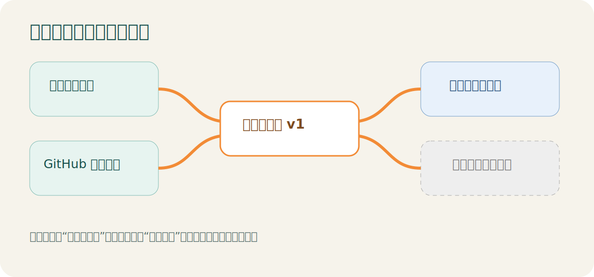

<p align="center">
  
</p>

# pink-mimi Skills 工具库

这里保存 `pink-mimi` 维护的内容研究与多平台制作 Skills。新版采用“研究层—平台制作层—发布层”结构：同一份经过核验的内容，可以制作成公众号版本，未来也能接入小红书等平台，而不必重新采集。



## 推荐组合

```text
daily-news-research ───┐
                       ├─→ 标准内容包 v1 → wechat-content → 一键复制 → 人工发布
github-hot-research ───┘
```

定时器只负责按日期唤醒研究 Skill；Skill 负责计算时间窗口、生成内容和审核材料。下载安装后不会自动每天或每周运行。

## Skills 一览

| Skill | 功能 | 使用状态 |
|---|---|---|
| [`daily-news-research`](daily-news-research/README.md) | 查询前一日新闻，完成时间过滤、去重、核验和筛选 | 推荐的新研究层 |
| [`github-hot-research`](github-hot-research/README.md) | 查询执行时刻前连续 7 天的 GitHub 热门项目并核验 | 推荐的新研究层 |
| [`wechat-content`](wechat-content/README.md) | 把标准内容包制作成可复制的公众号正文、配图和封面 | 推荐的平台制作层 |
| [`daily-news-wechat`](daily-news-wechat/README.md) | 新闻采集与公众号制作的一体化旧入口 | 继续兼容 |
| [`github-hot-wechat`](github-hot-wechat/README.md) | GitHub 热门与公众号制作的一体化旧入口 | 继续兼容 |

## 安装

查看所有 Skill：

```bash
npx skills add pink-mimi/skills --list
```

安装新闻研究和公众号制作：

```bash
npx skills add pink-mimi/skills --skill daily-news-research
npx skills add pink-mimi/skills --skill wechat-content
```

安装 GitHub 热门研究和公众号制作：

```bash
npx skills add pink-mimi/skills --skill github-hot-research
npx skills add pink-mimi/skills --skill wechat-content
```

## 使用步骤

### 每日新闻

1. 对 Codex 说：`使用 $daily-news-research，生成今天的新闻内容包。`
2. 审核 `content-package.json` 中的来源、时间和风险。
3. 对 Codex 说：`使用 $wechat-content，把这个内容包制作成公众号审核包。`
4. 打开 `微信版.html`，点击“一键复制公众号正文”。
5. 分别上传横版和方形封面，手机预览后人工发布。

### 每周 GitHub 热门

1. 对 Codex 说：`使用 $github-hot-research，生成本周 GitHub 热门内容包。`
2. 复核仓库主页、README、LICENSE、Release、Commit 和风险。
3. 使用 `$wechat-content` 生成公众号审核包。
4. 复制正文、上传封面并人工发布。

## 封面与图片

公众号制作固定输出：

```text
images/
├── 合并封面.png   # 1283×383：左侧长封面，右侧方封面，仅供审核
├── 横版封面.png   # 900×383，公众号上传
├── 方形封面.png   # 383×383，公众号上传
├── 项目-01.png ...
└── 结尾图.png
```

新闻和 GitHub 热门采用不同的文章结构、封面构图和主题；复制 HTML、图片尺寸检查和移动端安全规则由 `wechat-content` 共用。

## 自动化与发布

- 每日新闻默认窗口：北京时间 `[前一日 06:00，当日 06:00)`。
- GitHub 热门默认窗口：执行时刻向前连续 7 天。
- `--run-at` 可用于历史补跑和可重复验证。
- 重复运行默认使用 `stable` 模式复用同一期原始快照；只有明确使用 `--mode refresh` 才重新联网并保存修订记录。
- 自动化配置位于 Skill 外部，不会随安装自动启用。
- 当前只生成审核包，不上传或发布。
- 未来的 `wechat-publisher` 将作为独立 Skill，默认只保存草稿箱。

## 安全与版本

不得把密码、Cookie、GitHub Token、公众号密钥或读者数据写入 Skill、输出或 Git 仓库。稳定版本使用 Git Tag 标记；开发功能先在分支验证，再合并到 `main`。

[MIT License](LICENSE)
