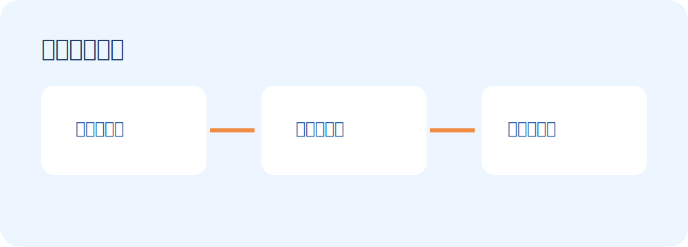

# 每日新闻研究 Skill



## 功能

查询北京时间前一日新闻，完成时间过滤、去重、分类、来源保留与质量门槛检查，输出可交给公众号或其他平台制作 Skill 的标准内容包。

它也提供独立的通用新闻查询，不需要另外安装 `$news`：支持热点、时政、财经、科技、社会、国际、体育、娱乐、AI 技术和 AI 社区，并可使用关键词、数量、摘要长度和 JSON 参数。

默认并行采集人民网的时政、财经、社会、国际和科技分类，以及中新网和 IT之家 RSS。单个来源默认 10 秒超时；某一来源失败不会阻塞其他来源，错误会保存在原始快照和风险清单中。

## 使用步骤

1. 安装：`npx skills add pink-mimi/skills --skill daily-news-research`
2. 对 Codex 说：`使用 $daily-news-research，生成今天的新闻内容包。`
3. 或运行：`python scripts/run.py all --output-root outputs`
4. 检查 `content-package.json`、候选记录和人工确认项。

临时查询示例：

```powershell
python scripts/run.py query --category finance --limit 10
python scripts/run.py query --category ai --keyword GPT --detail 500 --format json
python scripts/run.py sources
```

默认统计 `[前一日 06:00，当日 06:00)`；下载 Skill 后不会自行定时执行。

如果可用来源或类别覆盖不足，Skill 会返回 `needs_review`，不会转入没有边界的全网搜索来凑数量。

## 重复运行

默认 `stable` 模式会复用同一期的原始快照，因此再次运行不会因为网站临时变化而改写选题。需要主动更新时使用 `--mode refresh`，旧版本会进入 `revisions/revision-NN/`；只想用原快照重新筛选时使用 `--mode rebuild`。

## 来源报告

每次日报构建都会生成 `source-report.md`，记录新闻采集平台、成功与失败来源、本次采集成功率、候选数量和类别分布。完整平台清单及可靠性边界见 [`references/source-catalog.md`](references/source-catalog.md)。
