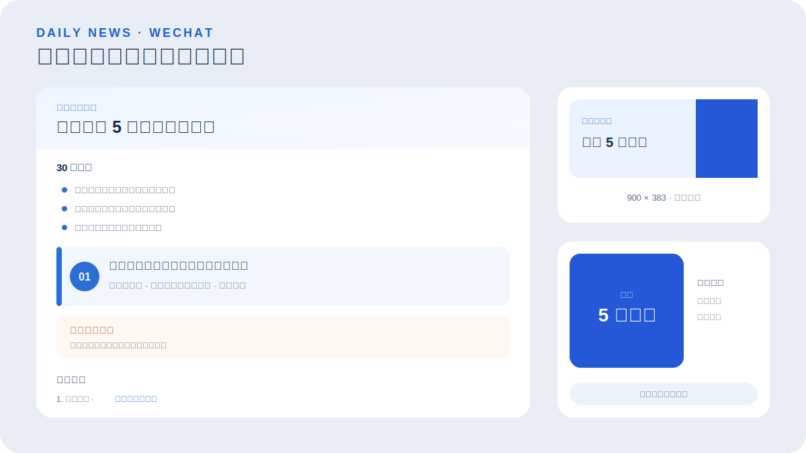

# daily-news-wechat

一套面向普通读者的每日新闻公众号生产工作流：在明确时间窗内采集新闻，完成去重、筛选和来源核验，再生成微信公众号文章、封面和人工审核包。

## 效果预览

<p align="center">
  
</p>

## 功能特点

- 默认按北京时间 `[昨日 06:00，今日 06:00)` 收集新闻
- 初步采集约 30—60 条，优先选出 5—8 条重要事件
- 按标题、关键词和事件主体合并同一新闻
- 政策、灾情和公共安全信息要求官方来源
- 默认覆盖至少 4 个方向，避免单一类别占满全文
- 输出 30 秒速览、新闻卡片、今日关注和可追溯来源
- 轮换 7 套视觉主题，分别生成横版与方形封面
- 只生成待审核材料，不自动发布到微信公众号

## 安装

```bash
npx skills add pink-mimi/skills --skill daily-news-wechat
```

## 快速开始

安装后可以直接向 Agent 描述需求：

> 使用 daily-news-wechat，整理北京时间昨日早上 6 点到今天早上 6 点的国内大事，生成公众号审核包。

也可以直接运行确定性流水线：

```bash
python daily-news-wechat/scripts/run.py all --output-root .
```

为了复现某次运行，可指定执行时间：

```bash
python daily-news-wechat/scripts/run.py all --output-root . --run-at 2026-07-19T06:20:00+08:00
```

## 输出内容

每次运行会生成候选池、待核验记录、入选新闻、Markdown 成稿、微信 HTML、备选标题、核验说明、运行报告，以及横版和方形两种 SVG/PNG 封面。

## 自定义

复制并修改 `assets/default-config.json`，可以调整：

- 每日时间窗口
- 国内或国际新闻范围
- RSS 来源和来源等级
- 每期新闻数量与类别上限
- 视觉主题和输出目录

## 人工审核边界

当来源不足、关键数字冲突、新闻发布时间不可靠或覆盖类别不足时，流水线会标记 `needs_review`。此时不应将文章视为可直接发布；需要人工检查原始链接、最新官方口径、标题表述、配图和移动端预览。
