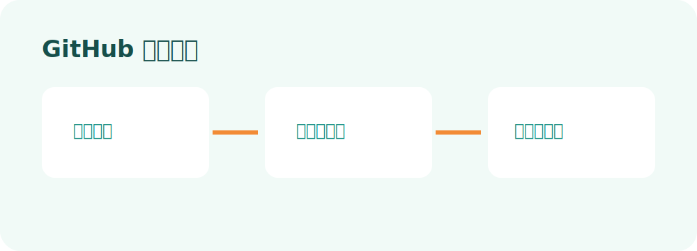

# GitHub 热门研究 Skill

## 功能

检索执行时刻前连续 7 天的 GitHub 热门项目，完成许可证、维护情况、用途、门槛、风险和历史重复检查，输出平台无关的标准内容包。

## 使用步骤

1. 安装：`npx skills add pink-mimi/skills --skill github-hot-research`
2. 对 Codex 说：`使用 $github-hot-research，生成本周 GitHub 热门内容包。`
3. 或运行：`python scripts/run.py all --output-root outputs`
4. 发布前复核仓库主页、README、LICENSE、Release 和最近 Commit。

下载 Skill 后不会自行每周运行；请使用 Codex 自动化或系统任务计划定时调用。

