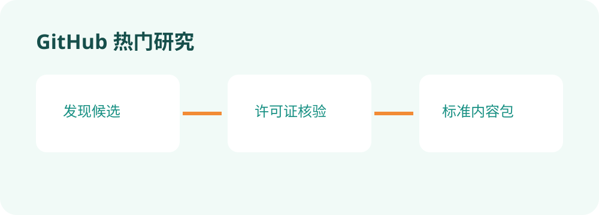

# GitHub 热门研究 Skill

## 功能

检索执行时刻前连续 7 天的 GitHub 热门项目，从 12—20 个候选中至少深度核验 8 个，默认精选 5 个，并输出平台无关的 schema v2 标准内容包。每个候选必须有本周热度证据，新爆款优先，成熟项目最多 2 个；内容包同时保留“为什么这周火”、读者卡、核验证据、风险、配图候选、Image2 brief，以及未入选项目和原因。

## 使用步骤

1. 安装：`npx skills add pink-mimi/skills --skill github-hot-research`
2. 对 Codex 说：`使用 $github-hot-research，生成本周 GitHub 热门内容包。`
3. 或运行：`python scripts/run.py all --output-root outputs`
4. 发布前复核仓库主页、README、LICENSE、Release、最近 Commit 和动态指标核验时间。

默认约束：入选 5—7 个，AI 项目最多 3 个，同类最多 3 个，最近 8 期去重。周增 Star 无法确认时为 `null`，绝不以 0 代替。

下载 Skill 后不会自行每周运行；请使用 Codex 自动化或系统任务计划定时调用。

## 重复运行

默认 `stable` 模式复用本期原始候选，保证重复生成稳定。主动重新联网使用 `--mode refresh`，旧快照和内容包会保存到 `revisions/revision-NN/`；只重新评分和筛选使用 `--mode rebuild`。
