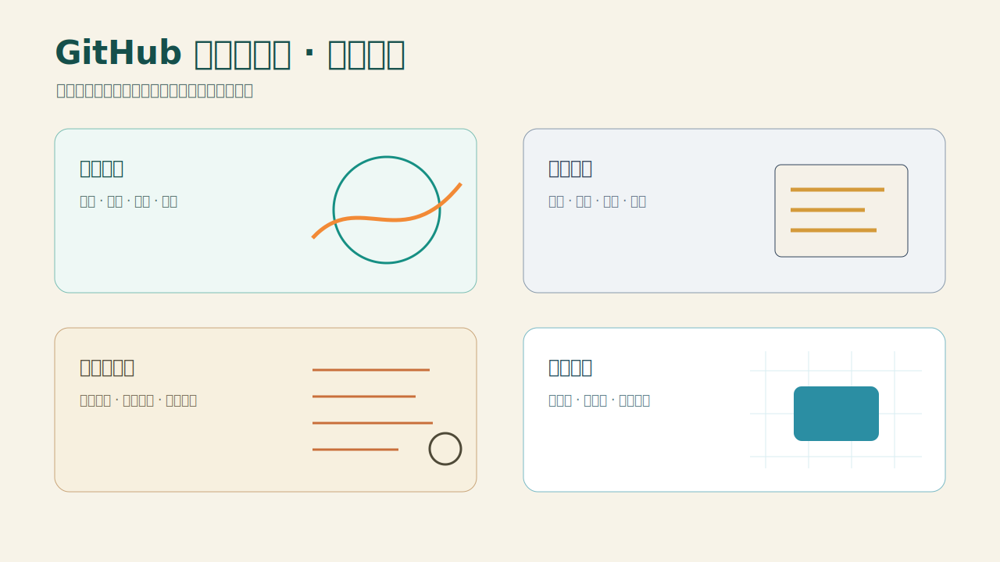

# GitHub 热门公众号 Skill

按指定的北京时间向前检索连续 7 天 GitHub 热门项目，完成候选核验、多样性筛选，并生成可复制到微信公众号的“未完地图”审核包。



## 特点

- 综合榜与多语言周榜发现，候选池 12—20 个。
- 默认精选 5 个，限制 AI 和同类项目集中度。
- 核验 README、LICENSE、Release、Commit、Issues 与风险。
- 扫描最近 8 期历史，避免无理由重复推荐。
- 4 套联动主题，可自动轮换或手动指定。
- Image 2 可选；不可用时自动生成模板图。
- 输出 Markdown、带一键复制按钮的微信 HTML、双尺寸封面和完整审核记录。
- 只生成审核包，不自动发布。

## 安装

```bash
npx skills add pink-mimi/skills --skill github-hot-wechat
```

## 使用

安装后可直接说：

```text
使用 $github-hot-wechat，以 2026-07-25 为执行日期，生成本周 GitHub 热门公众号审核包。
```

或运行：

```powershell
powershell -ExecutionPolicy Bypass -File scripts/run.ps1 all `
  --run-at 2026-07-25T09:00:00+08:00 `
  --output-root E:\mm\wxgzh\outputs `
  --theme auto `
  --image-mode auto
```

如果 Python 不在 PATH 中，可把解释器完整路径写入 `GITHUB_HOT_PYTHON` 环境变量；Windows 启动器也会自动识别 Codex 桌面的 bundled Python。

可选主题：`open-coordinates`、`code-archive`、`field-notes`、`clean-grid`。`GITHUB_TOKEN` 为可选环境变量，只用于提高 GitHub API 限额。

生成后必须打开 `运行报告.md` 和 `人工审核清单.md`，并在公众号手机端预览后由人工发布。
