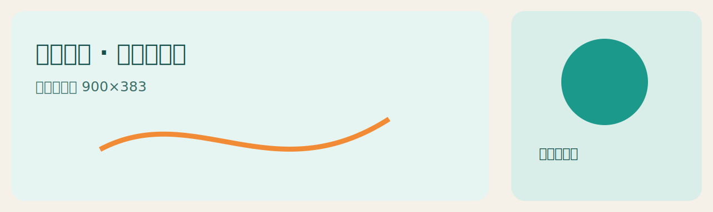
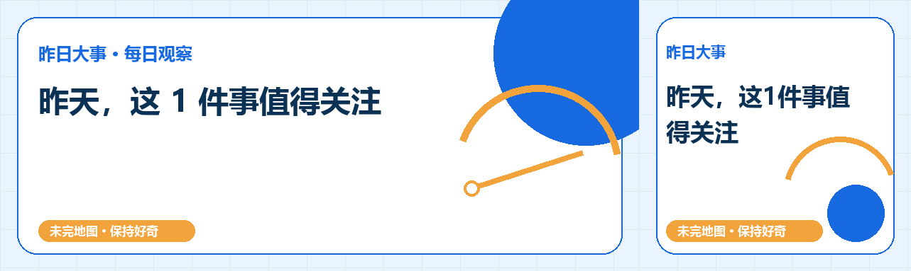

# 微信公众号内容制作 Skill





## 功能

读取标准内容包，自动选择对应栏目结构，生成标题、摘要、可一键复制的微信 HTML、内容配图，以及“左长、右方”的组合封面。新闻与 GitHub 热门使用独立内容模板，不再共用占位图。

## 使用步骤

1. 安装：`npx skills add pink-mimi/skills --skill wechat-content`
2. 先运行研究 Skill 得到 `content-package.json`。
3. 对 Codex 说：`使用 $wechat-content 把这个内容包制作成公众号审核包。`
4. 打开 `微信版.html`，点击“一键复制公众号正文”。
5. 分别上传横版和方形封面，手机预览后人工发布。

组合封面尺寸为 `1283×383`，左侧 `900×383`，右侧 `383×383`；组合图用于审核，两个独立文件用于上传。

## 新闻七天七色

`daily-news` 会按内容包执行日期的北京时间星期选择七套新闻配色与构图，同一天重复运行保持一致。Image 2 可用时，先生成无文字的 `cover.png` 和 `overview.png`，再运行：

```powershell
python scripts/run.py all --input content-package.json --output-root outputs --theme auto --image-input-dir work/news-images
```

有效动态图片在清单中记为 `live_image2`；没有传入或图片校验失败时，自动使用相应星期的内置图并记为 `weekday_fallback`。只有星期配置缺失或日期异常才启用第八套中性“默认兜底”。GitHub 热门不跟随这套星期轮换。

## 当前栏目模板

| 内容包 | 文章结构 | 图片表达 |
| --- | --- | --- |
| `daily-news` | 昨日坐标、事件摘要、时间、来源、观察式结尾 | 新闻节点和变化轨迹 |
| `github-hot` | 开源坐标、用途、亮点、门槛、维护、许可证、风险 | 项目用途和代码连接 |

## 稳定重排

研究 Skill 负责联网更新内容；本 Skill 只负责渲染已有内容包。新闻提示标题会根据条目内容稳定选择；同一内容包、模板版本与主题重复运行时，提示标题、结构和排版保持一致。每次输出的 `render-manifest.json` 会记录模板及主题版本。

## 读者正文保护

- 新闻统计时段、来源和结尾说明只使用面向读者的语言，不显示内容包核验、人工审核或尚未发布等内部状态。
- 结尾说明根据当天的天气灾害、市场、政策和争议信息自动组合；没有特殊主题时使用中性来源说明。
- 提示标题主要依据分类、关键词、标题和摘要，避免行动建议中的偶然词语造成误判。
- “今天值得关注”会删除与新闻标题重复的观察点；没有有效观察点时自动省略。
- `needs_review` 内容包会禁用复制按钮，审核提示只显示在正文复制区之外。
- `daily-news` 与 `github-hot` 使用各自独立的读者规则。

## 安装要求

- Python 3.10+
- Pillow：`python -m pip install Pillow`

Skill 不依赖本机安装 `wechat-article-writer`，也不会自动上传或发布公众号。
